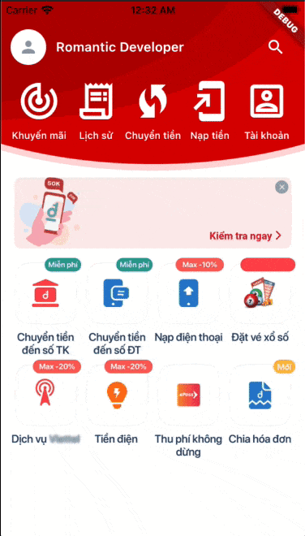

# Flutter Collapsing Toolbar

A Flutter package to create a Romantic Collapsing Toolbar. It will be useful for your awesome app.
This widget is created to be able to standalone with any views, helps you able to add it into any complex ScrollView or ListView.

This is a present from Romantic Project. More from [Romantic Developer](https://pub.dev/publishers/romanticdeveloper.com/packages)



### Example

```dart
import 'package:flutter/material.dart';
import 'package:flutter_collapsing_toolbar/flutter_collapsing_toolbar.dart';

void main() => runApp(MyApp());

const kSampleIcons = [
  Icons.track_changes_outlined,
  Icons.receipt_long_outlined,
  Icons.wifi_protected_setup_outlined,
  Icons.add_to_home_screen_outlined,
  Icons.account_box_outlined,
];
const kSampleIconLabels = [
  'Khuyến mãi',
  'Lịch sử',
  'Chuyển tiền',
  'Nạp tiền',
  'Tài khoản',
];

class MyApp extends StatefulWidget {
  @override
  _MyAppState createState() => _MyAppState();
}

class _MyAppState extends State<MyApp> {
  final controller = ScrollController();
  double headerOffset = 0.0;

  @override
  Widget build(BuildContext context) {
    return MaterialApp(
      title: 'Example',
      theme: ThemeData(
        primarySwatch: Colors.red,
      ),
      home: Scaffold(
        body: Container(
          margin: const EdgeInsets.only(top: 24.0),
          child: Column(
            children: [
              Align(
                alignment: Alignment.topCenter,
                child: CollapsingToolbar(
                  controller: controller,
                  expandedHeight: 160,
                  collapsedHeight: 64,
                  decorationForegroundColor: Color(0xffd90000),
                  decorationBackgroundColor: Colors.white,
                  onCollapsing: (double offset) {
                    setState(() {
                      headerOffset = offset;
                    });
                  },
                  leading: Container(
                    margin: EdgeInsets.only(left: 12),
                    padding: EdgeInsets.all(4),
                    decoration: ShapeDecoration(
                      color: Colors.white,
                      shape: CircleBorder(),
                    ),
                    child: Icon(
                      Icons.person,
                      size: 24,
                      color: Colors.black38,
                    ),
                  ),
                  title: Text(
                    'Romantic Developer',
                    style: TextStyle(
                      fontSize: 16,
                      color: Colors.white,
                      fontWeight: FontWeight.w600,
                    ),
                  ),
                  actions: [
                    ElevatedButton(
                      onPressed: () {},
                      style: ButtonStyle(
                        shape: MaterialStateProperty.all(CircleBorder()),
                        backgroundColor:
                            MaterialStateProperty.all(Colors.transparent),
                        elevation: MaterialStateProperty.all(0.0),
                      ),
                      child: Padding(
                        padding: const EdgeInsets.all(8.0),
                        child: Icon(
                          Icons.search,
                          color: Colors.white,
                          size: 24,
                        ),
                      ),
                    ),
                  ],
                  featureCount: 5,
                  featureIconBuilder: (context, index) {
                    return Icon(
                      kSampleIcons[index],
                      size: 54,
                      color: Colors.white,
                    );
                  },
                  featureLabelBuilder: (context, index) {
                    return Text(
                      kSampleIconLabels[index],
                      textAlign: TextAlign.center,
                      maxLines: 1,
                      style: TextStyle(
                        fontSize: 12,
                        color: Colors.white,
                      ),
                    );
                  },
                  featureOnPressed: (context, index) {},
                ),
              ),
              Expanded(
                child: Container(
                  color: Colors.white,
                  child: SingleChildScrollView(
                    controller: controller,
                    child: Column(
                      children: [
                        Container(
                          height: headerOffset,
                        ),
                        Image.asset('assets/sample.jpg'),
                        Container(
                          height: 350,
                          color: Colors.white,
                        ),
                      ],
                    ),
                  ),
                ),
              ),
            ],
          ),
        ),
      ),
    );
  }
}

```

### Development environment

```
[✓] Flutter (Channel stable, 2.0.5, on macOS 11.2.3 20D91 darwin-x64, locale en-VN)
    • Flutter version 2.0.5
    • Framework revision adc687823a (11 days ago), 2021-04-16 09:40:20 -0700
    • Engine revision b09f014e96
    • Dart version 2.12.3

[✓] Android toolchain - develop for Android devices (Android SDK version 30.0.3)
    • Platform android-30, build-tools 30.0.3
    • Java binary at: /Applications/Android Studio.app/Contents/jre/jdk/Contents/Home/bin/java
    • Java version OpenJDK Runtime Environment (build 1.8.0_242-release-1644-b3-6915495)
    • All Android licenses accepted.

[✓] Xcode - develop for iOS and macOS
    • Xcode at /Applications/Xcode_12.app/Contents/Developer
    • Xcode 12.4, Build version 12D4e
    • CocoaPods version 1.10.1

[✓] Chrome - develop for the web
    • Chrome at /Applications/Google Chrome.app/Contents/MacOS/Google Chrome

[✓] Android Studio (version 4.1)
    • Android Studio at /Applications/Android Studio.app/Contents
    • Flutter plugin can be installed from:
      🔨 https://plugins.jetbrains.com/plugin/9212-flutter
    • Dart plugin can be installed from:
      🔨 https://plugins.jetbrains.com/plugin/6351-dart
    • Java version OpenJDK Runtime Environment (build 1.8.0_242-release-1644-b3-6915495)
```